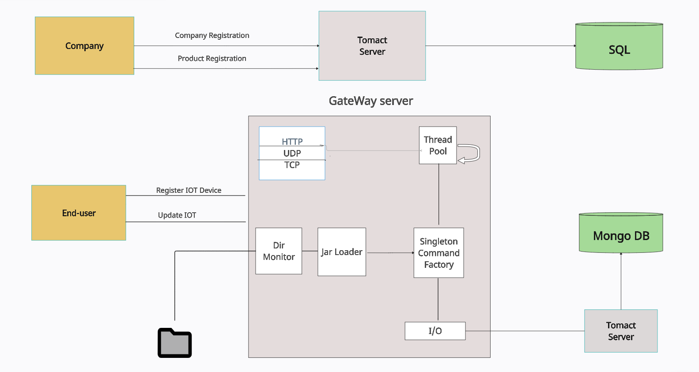

<h1> Iot-Gateway</h1>

<h2> Overveiw</h1>

The Generic IoT Infrastructure Project is a scalable and flexible solution designed to manage IoT devices, store their data, and analyze it in a fast and easy way. 
This project was developed as part of my Java studies and incorporates various design patterns such as Factory, Singleton, Object Pool, and Observer,
  while adhering to SOLID and OOP principles.
  The infrastructure consists of multiple modules, each developed independently and integrated together to form a cohesive system. These modules were 
  built using modular development practices and can be extended or replaced with custom implementations to meet specific requirements.

 
 <h2>Requerment</h2>
In my studies, I was required to work with the following set of requirements:

  * Generics
  * Concurrency
  * Plug & Play
  * Fault tolerance

To fulfill these requirements, the system designed as follows:

The Gateway Servlet is a receiver for client requests, supporting various request types through HTTP,( UDP in the future). It achieves this by employing generic data handling techniques. Additionally, each module within the system is designed to be generic, allowing for flexibility and reusability across different functionalities.

Concurrent processing techniques are employed in the Gateway Servlet to handle multiple requests simultaneously, ensuring efficient utilization of system resources. 
The system will support a plug-and-play architecture, allowing for the dynamic integration of different components and modules based on specific requirements. 
Additionally, fault tolerance mechanisms will be integrated to assist the system in handling failures and ensuring system stability and availability. 
It's worth noting that although these modules have been built, they have not yet been integrated into the project.
  
<h2>Flow</h2>
 
  * The Gateway Servlet receives requests from clients through HTTP protocols.
  * The Gateway Servlet parses the request into JSON format.
  * The parsed request is added as a new task to the Thread Pool.
  * The Thread Pool assigns the task to a worker thread for execution.
  * The Singleton Command Factory creates an instance of the selected command.
  * The executed command interacts with the MongoDB module for data storage and retrieval.
  * The command performs specific operations based on the requested function, executing I/O operations on the MongoDB database.
  * The result of the command execution is returned.
  * The Response is prepared and sent back to the client.

